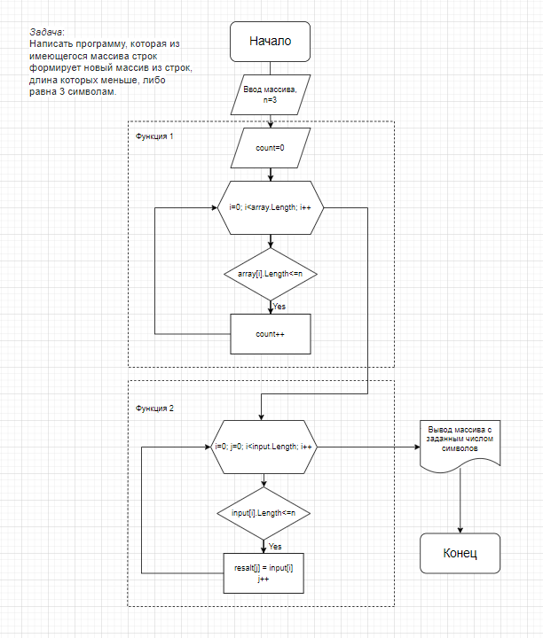

# Итоговая контрольная работа
## Задача:
Написать программу, которая из имеющегося массива строк формирует новый массив из строк, длина которых меньше, либо равна 3 символам. Первоначальный массив можно ввести с клавиатуры, либо задать на старте выполнения алгоритма.  *При решении не рекомендуется пользоваться коллекциями, лучше обойтись исключительно массивами*. 
**Примеры:**
 [“Hello”, “2”, “world”, “:-)”] → [“2”, “:-)”] 
[“1234”, “1567”, “-2”, “computer science”] → [“-2”] 
[“Russia”, “Denmark”, “Kazan”] → []
## Алгоритм решения:
1. Вводим исходный строковый массив через пробел.
2. Создаем функцию, определяющую количество символов в исходном массиве (*CountArray*).
3. Создаем функцию, которая выводит новый массив с определенным количеством символов (*ReliseArray*).
4. Выводим новый массив.
## Дополнительная информация:
1. Программа расположена в папке task.
2. Блок-схема алгоритма решения задачи:
   